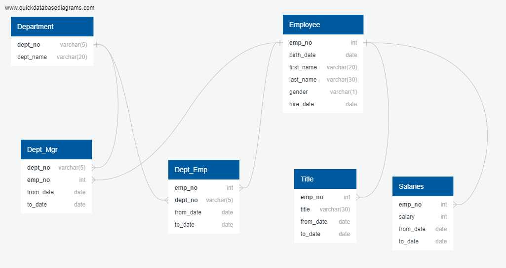
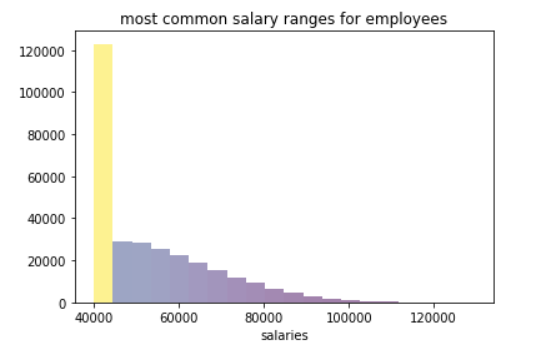
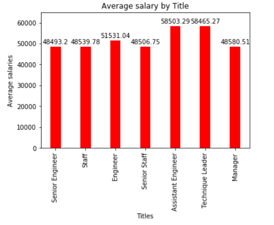

# SQL - Employee Database

These tasks are performed for the given csv files for Employee data:

1. Data Modeling
* Inspect the CSVs and sketch out an ERD of the tables.

2. Data Engineering
* Create table schema and import the data for each of the six CSV files

3. Data Analysis
* Run some SQL to explore data stored in the tables created above

## Data Exploration using SQLAlchemy 

1. Histogram to visualize the most common salary ranges for employees.

2. Bar chart of average salary by title.

----

## Libraries and Tools used:
- Pandas ,Numpy ,Matplotlib
- psycopg2, SQLAlchemy
